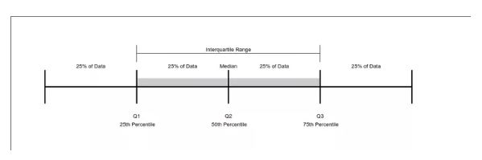

<h1 style='color:grey; font-style:italic'>What Is a Quartile?</h1>
<p>A quartile is a statistical term that describes a division of observations into four defined intervals based on the values of the data and how they compare to the entire set of observations. Quartiles are organized into lower quartiles, median quartiles, and upper quartiles.</p>

```When the data points are arranged in increasing order, data are divided into four sections of 25% of the data each.```

</img>

<h2 style='color:grey; font-style:italic'>How to calculate quartiles?</h2>

<p> We have three quartiles in a given data</p>

Let say our given data is an array of unordered numbers

scores = [21,40,33,38,25,28,30]


Step-1: Organize given data in ascending order

scores = [21,25,28,30,33,38,40]

Step-2: Count the length of the data (n) and using the formula below :
- First Quartile (Q1) = (n + 1) x 1/4
- Second Quartile (Q2), or the median = (n + 1) x 2/4
- Third Quartile (Q3) = (n + 1) x 3/4

For the above example
 n = 7
 - First Quartile (Q1) = (7 + 1) x 1/4 = 2 - means the position at 2 is the first quartile. But in arrays the index starts with 0 and that means the position at 2-1 = 1 is the first quartile scores[1] = 25
 - Second Quartile (Q2), or the median = (7 + 1) x 2/4 = 4
 scores[4-1] = 30 is the second quartile
 - Third Quartile (Q3) = (7 + 1) x 3/4 = 6 but in array at index of 5
 scores[5] = 38 is the third quartile

 So in this exercise I made a program that calculated the quartiles of a given set of data using javaScript.


